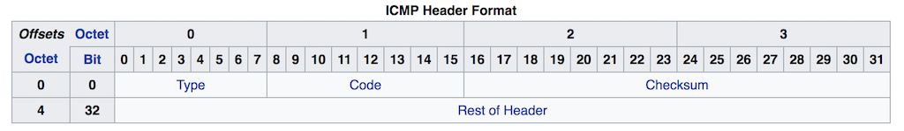

## CSET 2200 Lecture 11

---

## Questions

---

## Summary of TCP
### AKA - What you actually need to remember

- Stream Oriented
- Reliable
    - In order delivery
    - Error Handling
- Providers Virtual Circuits
- Multiplexed

---

## Summary of TCP

- Three Way Handshake initiates
    - SYN
    - SYN/ACK
    - ACK
- Four Way connection teardown
    - FIN
    - ACK
    - FIN
    - ACK

---

## Summary of TCP

- Each packet sent gets an ACK
- Up to window size can be sent without an ACK
- Newer TCP does Window Scaling to get bigger

---

## Questions

---

## Layer 4 - UDP/ICMP

- UDP - User Datagram Protocol
- ICMP - Internet Control Message Protocol

---

## UDP

- User Datagram Protocol
- Connectionless
- Unordered
- No guaranteed delivery

---

## UDP (contd)

- PDU is datagram
- Stateless
- Can support broadcast

---

## UDP (contd)

- Used when overhead of TCP too high
- Delay sensitive such as video or voice
- Broadcast and unidirectional well suited for some applications

---

## UDP Header

---

## ICMP

- Internet Control Message Protocol
- "Control Messages" for IP
- Technicall Internet Layer
- Still Layer 4 in OSI model

---

## ICMP (contd)

- Used by many internet utilities
    - ping
    - traceroute
- Also used to send errors
    - Destination Unreachable
- Many misc functions

---

## ICMP Header

---

## Type Field

- 0 = Echo Reply
- 3 = Destination Unreachable
- 5 = Redirect
- 8 = Echo Request
- 11 = Time Exceeded

---

## Code

- Depends on Type
- Type 3 has many, 5 and 11 a few
- Type 3
    - 0 = Destination Network Unreachable
    - 1 = Destination Host Unreachable
    - 4 = Fragmentation Required - DF Set
    - 9 = Host Admin denied
    - 10 = Network Admin Denied
    - 13 = Communication Admin Denied

---

## Ping

- Sending host sends echo request
- Receiving host replies with echo reply
- Payload data the same

---

## Traceroute

- Host sends packet with ttl of 1
    - ICMP Echo request, UDP or TCP
- TTL expires, router or host replies with ICMP Type 11
- Increment TTL and send again until response received from target

---

## Questions

---

## End of Layer 4

---

## Subneting

---

## Next class

- Discussion of layers 5/6
- Start of discussions on some Layer 7 protocols
