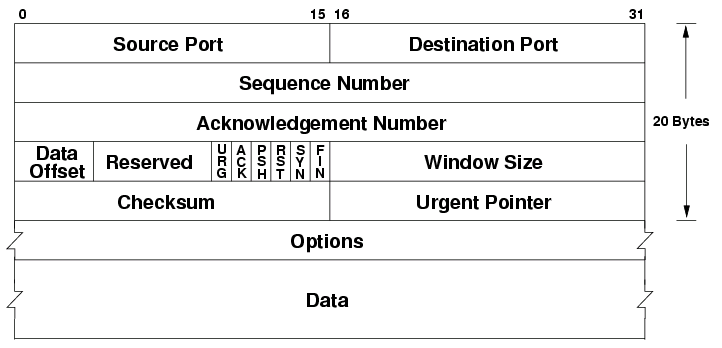
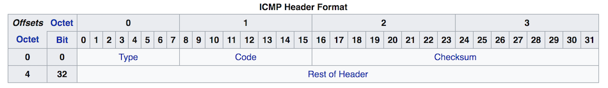

## CSET 2200 Lecture 14 - Summary Day!

---

## Physical Layer

- PDU: Bit
- Electrical or Optical implementation that carries data
- Ethernet, Token Ring, Wifi, Bluetooth, etc

---

## Data Link Layer

- PDU: Frame
- Handles local communication

---

## Ethernet

- Has pieces of Layer 1 and Layer 2
- 802.3 is the IEEE working group
- Primary LAN technology

---

## Ethernet PHY

- Layer 1 piece of Ethernet
- Defines Electical Format
    - 10Base2 - Thin Coax
    - 10Base5 - Thick Coax
    - 10BaseT - Twisted Pair
    - 100BaseT - 100mbps
    - 1000BaseT, 10GBaseT, etc - all Twisted Pair
    - XBaseFX/LX/SX/ZX - Ethernet over Fiber

---

## Ethernet Layer 1

- Broadcast Medium
- Every frame is seen by everyone
- Various devices such as switches limit this

---

## CSMA/CD

- Carrier Sense Multi Access with Collision Detect
- Listen before you transmit
- When gap transmit and listen
- If garbage, back off random time and try again

---

## Collision Domain

- Hosts that all receive broadcasts electrically
- Switches limit broadcast domain

---

## Full vs Half Duplex

- With half one transmitter at a time
- With full both can - only 2 stations possible

---

## Layer 2 - Ethernet

- PDU: Frame
- Address - 6 byte MAC address
- Format:
    - 6 Byte Dest Mac
    - 6 Byte Src Mac
    - Optional 4 byte tag
    - 2 Byte type (Or size then type)
    - Pay load

---

## Devices

- Repeater extends reach
- Hub just connects multiple twisted pair - dumb and half duplex
- Bridge joins two collision domains
- Switch is a multi port bridge
    - Each port collision domain
    - Usually full duplex

---

## Layer 3

- PDU is packet
- Address - 4 byte IP address
   - Dotted quad
- Each network has a network and a mask
- Mask decides if address is local

---

## ARP

- Used to Map layer 3 to Layer 2
- Sent to broadcast asking who has an IP
- Response is Unicast with answer

---

## IPv4

- Connectionless
- Best effort
- Addresses allocated by IANA

---

## Classes

- A = 0-127 (128 networks, 2^24 hosts)
- B = 128-191 (16384 netwirks, 2^16 hosts)
- C = 193-223 (2^21 networks, 256 hosts)
- D = 224-239 (Multicast)
- E = 240-255 (Experimental)
- Can be combined or split if classless

---

## RFC1918 Space

- Private use
- 10.0.0.0/8
- 172.16.0.0/12
- 192.168.0.0/16

---

## IPV4 Header

---

## Subnets

- Written as dotted quad or CIDR mask
- 1 is care bit or network address
- 0 is host addresses
- Binary AND to determine if local

---

## CIDR

- Classless Inter-Domain Routing
- Uses VLSM
    - Variable Length Subnet Mask

---

## VLSM

- Split network and host at any boundary
- We can combine adjacent networks or split big ones
- Use Tree method to split networks if needed

---

## Layer 4

- TCP
- UDP
- ICMP

---

## TCP

- Transport Control Protocol
- PDU: Segment
- Connection Oriented
- Stream Oriented
- Reliable
    - In Order Deliery
    - Error Handling

---

## TCP Header

---

## TCP connections

- 3 way handshake to connect
- 4 way handshake to disconnect
- Each packet gets ACK
- Scaling controls ACK with no reply

---

## UDP

- PDU: Datagram
- User Datagram Protocol
- Connectionless
- Unreliable
- Used by services that need low latency

---

## UDP Header

---

## ICMP

- Intenret Control Message Protocol
- Error handling
- Also used for Ping/Traceroute

---

## ICNP Header

---

## Layer 5 - Session

- Not much to talk about
- Handles Persistence
- Not present in TCP/IP Model

---

## Layer 6 - Presentation

- Again boring
- Handles data conversion
- Also not in TCP/IP Model

---

## Layer 7 - Application

- What we care about if not network people
- Carries user data
- Many Protocols

---

## BOOTP

- Used to get IP address from ARP
- Opposite of ARP kinda
- Static mappings
- Simple request/reply

---

## DHCP

- Extends BOOTP to add dynamic pools
- Supports passing other options
    - Discover
    - Offer
    - Request
    - Acknowledge

---

## DNS

- Domain name system
- Maps hosts to IP and vice versa
- Many hosts to one IP
- One IP to one hostname
- Hierachal - also a tree

---

## DNS (contd)

- A record = Answer - Hostname
- NS Record = Name Server - Delegation
- CNAME Record = Alias
- PTR record = Pointer - Reverse

---

## Internetworks

- Link many local networks
- Internet large example
- Changing as time goes on

---

## Router

- Links multiple layer 2 networks
- Moves packets at layer 3

---

## Route table

- Contains destination network
- Mask
- Next Hop IP
- Metric

---

## Routing

- Most specific match wins
- On tie metric breaks it
- Metric varies by protocol
- Default Gateway (0.0.0.0/0) = Where packets go if not known

---

## Questions

---

## Next Session

- Review game/session
    - Lucas will have exam so will likely give good review
- Exam 2 weeks from today

