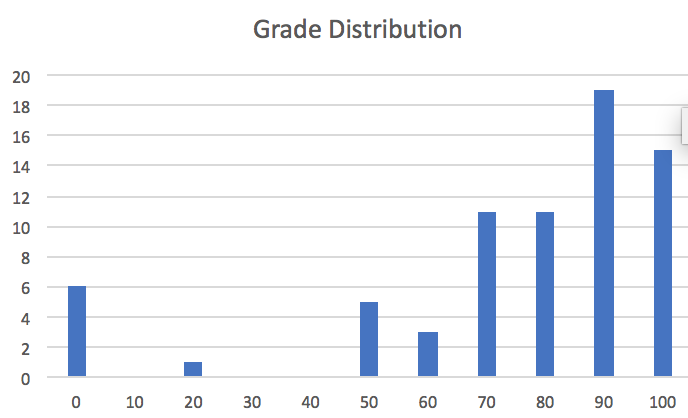

## CSET 2200

---

## Exam Results

---

## Stats

* Median 80
* Mean 71.2
* Std Deviation 26.4

---

## Stats (contd)

* 2 100's

---

## Explanation

---

## Other Administrivia

---

## And now for something completely different

* Switching gears to practical
* Will be closer aligned with lab

---

## Simulators and Emulators

* Simulators don't run actual code
* Given inputs fake output
* Emulators run actual code

---

## Packet Tracer

* Simulator
* Used in Lab

---

## VIRL

* Emulator
* Runs IOS (Cisco software) on Openstack
* Used for more advanced tests
* What I use

---

## Intro and Example

---

## Questions

---

## Next class - Routing

---
