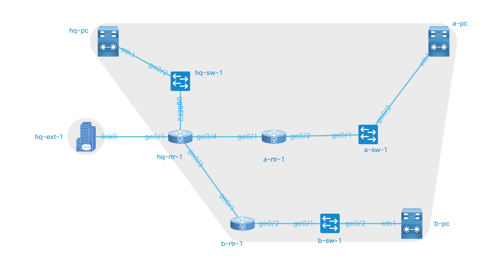

## CSET 2200

### IP Routing

---

## Review (Again)

- Routing is the process of moving packets between networks
- Performed by Routers
- Handles Layer 3
- Relies on other layers to actually move the data

---

## General Routing Rules

- Is Packet Local - If so Layer 2
- Consult routing table - find most specific match
- Rewrite packet with new Checksum, TTL, etc
- Forward to Layer 2 address found

---

## Building Routing tables

- Two ways tables are generall built
    - Static Routing
    - Dynamic Routing

---

## Static Routing

- Administrator manually configures route table
- Enters network, mask and destination
- Usually most preferred routes
- Has scalability issues
- Cannot adapt to change

---

## Dynamic Routing

- Uses an algorithm to build the route table
- If we have more than one route, favor the best
- If a route is removed add next best route
- Three general classes of Routing Protocol
    - Distance Vector
    - Link State
    - Hybrid

---

## Distance Vector Routing

- Use a Distance and A Vector (duh)
- Distance is often number of hops
- Vector is the next hop IP
- Lowest hop count wins
- Information broadcast
- Simplest Protocol
- RIP common example

---

## Link State Routing

- Route receives entire topology
- Has metrics for each link
- Calculates the shortest path using information
- Dijkstra's algorithm often used
- Much more complex than distance vector
- OSPF, IS-IS examples

---

## Hybrid Protocols

- Combines pieces of Link State and Distance Vector
- Usually uses metrics such as bandwidth and hops
- May or may not have entire topology
- Usuaully not broadcast
- Examples include RIPv2, EIGRP, BGP

---

## Configuring Static Routes

```
ip route <network> <mask> <ip>
```

---

## Example



---

## Basic Interface Configuration

```
interface <xxx>
ip address <address> <mask>
no shutdown
```

## Verification and Troubleshooting

- ping
- traceroute
- sh ip route
- sh ip int br
- sh int

---

## More about RIP v2

- Can have loops
- Only suitable for small simple networks

---

## Configuring RIP v2

```
router rip
  network a.b.c.d
  version 2
```

---

## Questions

---

## Next class - Layer 2 extensions (VLANs)


