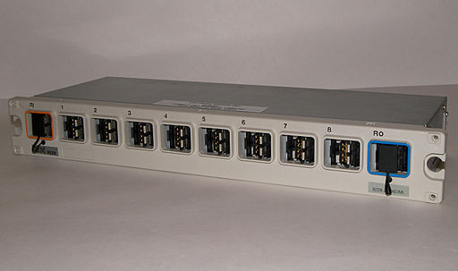

## CSET 2200

### Lecture 3 - OSI Model/TCP Model/Network Theory

---

## Review network history

---

## The OSI model

#### AKA that thing you need to learn but don't directly use

---

## The OSI Model

* Joint ISO and CCITT
* 1984 published
* Abstract model of networking
* Influenced later designs
* Still used for reference
* Things at each layer speak to each other via PDU (Protocol Data Units) using above and below layers

---

## Ways to remember it

Programmer's don't need to see pretty applications

---

## Ways to remember it

Please do not throw sausage pizza away

---

## Ways to remember it

People don't need those stupid packets anyways

---

## Ways to remember it

Please do not teach students pointless acronyms

---

## Physical Layer

* Data Unit: Bit
* Electrical
* Various technologies (Ethernet/Token Ring/Wifi)

* Defined largely by IEEE (Institute of Electical and Electronics Engineers)
* Working groups define electrical signals
* May be light in the case of fiber
* May also be radio waves
* Bluetooth, Zigbee, Wifi, Token Ring, Ethernet all examples

---

## Data Link Layer

* Data Unit: Frame
* Reliable Transport
* Ethernet - 802.2

* Connections between local nodes in LAN
* Adjacent nodes in WAN (PtP)
* Provides syncronization
* Adds error control

---

## Network Layer
* Data Unit: Packet
* Not guaranteed to be reliable
* May split packets if too big
* IP

* Connectionless model
* Provides host addressing (MAC vs IP)
* Provides forwarding of data between layer 2 networks (Router)
* IP/IPv6/ICMP/IPX

---

## Transport Layer
* Data Unit: Datagram, Segment
* Provides multiplexing and flow control
* UDP, TCP

* Adds connection oriented services to Network
* Not ALL are connection oriented (UDP)
* Mutiplexing
* Reliability
* TCP, UDP

---

## Session Layer
* Handles Burrito Delivery (Just seeing if you're paying attention)
* Handles sessions and establishment of connections
* Nothing really in TCP/IP model

* Can handle connection restoriation
* AAA sometimes handled here
* X25 and Appletalk ZIP examples

---

## Presentation Layer
* Handles converting data between formats
* Allows program to be absolved of conversions
* Presentation layer is usually OS, but may be application

* Might convert file formats (ASCII/EBDIC)
* Serialization of program data can happen here (Raw data to JSON or XML)
* Application level encryption like SSL is here too

---

## Application Layer

* Application all the things
* Handles higher level protocals implemented in the application
* Examples include SMTP, NNTP, FTP

* Much higher level protocols that deliver data, etc
* DNS, DHCP, BootP will be discussed in class

---

## TCP/IP Model

* Implemented in practice
* Based on OSI model, but collapses some for simplicity
* Application, Presentation and Session just moved to application
* Most of these done in software anyways

---

## Comparisons of Models

* TCP/IP simplified
* I believe 5 layers
* Segregates protocols more logically

* Example of theoritical model vs implementation
* Much less loosely defined than OSI model

---

## Questions?

---

## General Network Discussion

---

## Next week 

