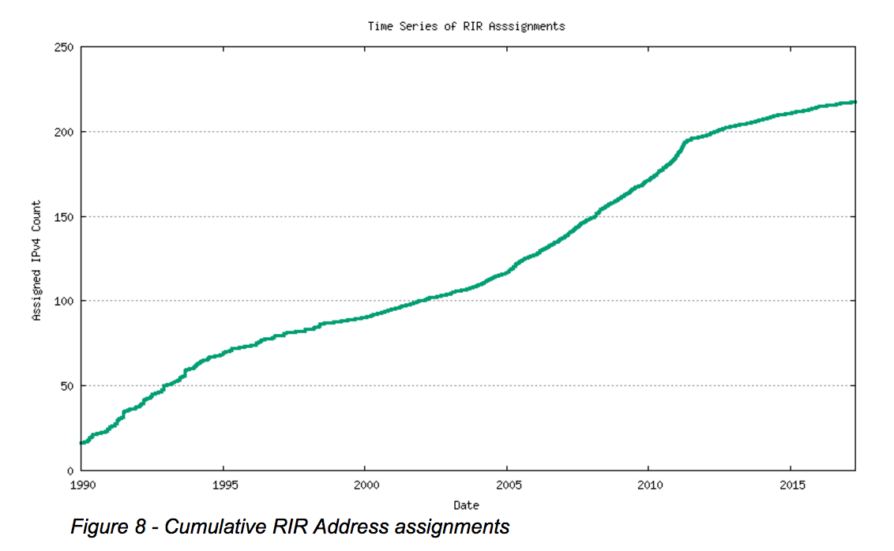

## CSET 2200

### IPv6

---

## IPv4 exhaustion

- IPv4 provides 4294967296 IPs
- Seems like plenty
- In effect not enough
    - Classful is wasterful
    - Many /8 unavailable

---

## Short term solutions

- PAT/NAT bought us time
- CIDR helped allocate better

---

## Address Allocation

http://www.potaroo.net/tools/ipv4/

---

## Enter IPv6

- 128 bit address space
- Builds on work of IPv4

---

## IPv6 Addresses

340282366920938463463374607431768211456

---

## IPv6

- Defines a new IP protocol
- RFC 2460
- Requires changes to many underlying protocols

---

## IPv6 Address Format

- 8 groups of 4 hex digits
- Remember each hex digit 0-15 (4 bits)
- 16 bits per group * 8 group = 128 bits

---

## Example

- 2001:0470:c3af:0000:0000:0000:0000:0000/48

---

## Address abbreviation

- Leading 0's can be omitted
- A single group of multiple 0 groupings can be replaced by ::
- 2001:470:c3af::/48 would be above

---

## IPv6 Networks

- Similar to IPv4
- We have Host and network pieces
- If multiple of 4 or 16, easy with hex
- Else we need to go to binary

---

## IPv6 Prefixes

- Start with 2 or 3 global routed
- 2001 = US
- 3FFE = old experimental space still used

---

## IPv6 Reserved Prefixes

- FD = Unique Local
- FF = Multicast
- FE80 = Link Local

---

## Subnet Allocation

- Most often a /64 allocated
- Makes auto addressing easier
- Companies usually get a /48

---

## Interface Addressing

- Interfaces can be statically assigned
- Also assigned via EUI-64

---

## EUI-64

- Based on MAC address
- Should be unique
- Split MAC address in half
- Insert FFFE between the halves
- Flip bit 7 of first octet

---

## Example

- 78:31:c1:c0:76:fc
- 7831:c1 c0:76fc
- 7831:c1ff:fec0:76fc
- 5831:c1ff:fec0:767v

---

## Assigning addresses to hosts

- Normally EUI-64 addresses
- Can also be DHCP
- Neighbor Discovery Protocol used too
- Stateless Address Auto Configuration (SLAAC)

---

## Neighbor Discovery Protocol

- Helps hosts find neighbors
- Replaces ARP
- Also supports prefix discovery
- Router discovery

---

## DHCP and IPv6

- DHCP does not provide default router
- Can be used stateless with NDP SLAAC to help

---

## Special Multicast Addresses

- FF02:1 - All Nodes
- FF02:2 - All Routers
- FF02:9 - RIPNng

---

## Configuring IPv6 on Cisco Routers

- Need to enable ipv6
- Command is ipv6 unicast-routing

---

## Interface Configuration

- ipv6 address <address>/<prefix length>
- ipv6 address <network>/<prefix length> eui-64
- ipv6 address dhcp
- ipv6 address autoconfig

---

## IPv6 Routing

- ipv6 route <prefix>/<prefix length> <interface>
- ipv6 route <prefix>/<prefix length> <address>
- ipv6 route <prefix>/<prefix length> interface <address>
- Default can be set with autoconfig

---

## Questions

---

## Demonstration

