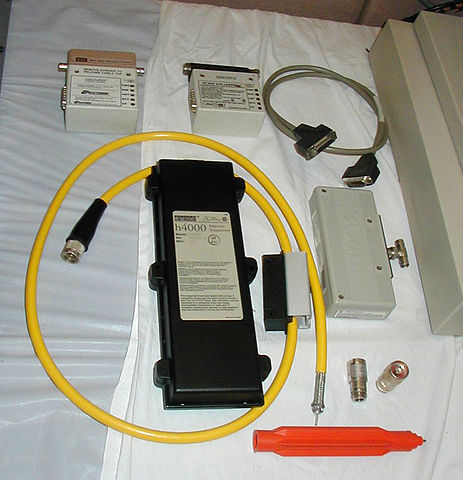
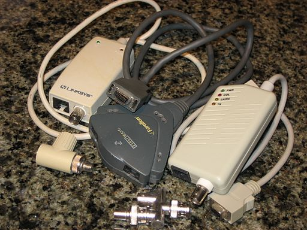
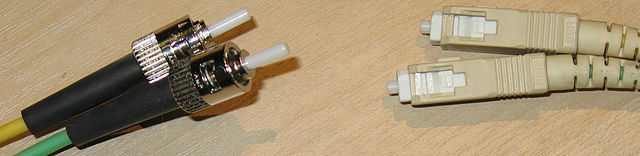

## CSET 2200 Lecture 4

---

## Ethernet - Layer 1/2

- Primary access used by wired clients
- Defined by IEEE
- Originally 802.3 group but others

---

## Ethernet - Layer 1/2

- Ethernet PHY describes layer 1 piece
- Electrical standards over Coax or Twisted Pair
- Names are (speed)Base(Technology)

---

## Coax

---

## 10Base5

- 10mbps over thick coax
- Used N connector or vampire tap
- Bus based - shared access

---

## 10Base2

- 10mbps over thin coax
- Called thinnet
- Used BNC connectors
- Also bus based - used a terminator

---

## Twisted Pair

---

## 10BaseT

- T means Twisted Pair
- 10mbps over 8P8C cable (RJ45/Cat 3)
- 100m max length
- Star - requires hub or switch

---

## 100BaseT

- 100mbps over Cat 5 cable
- Uses 2 pairs
- 100m max length
- 100BaseT4 for a 4 pair version over cat 3

---

## 1000BaseT

- 1gpbs over Cat 5 ot 5e cable
- Uses all 4 pairs
- Full Duplex only in practice
- Also 100m max length

---

## 10GBaseT

- 10gbps over Cat 6 (55m) or Cat 6a (100m)
- 2.5GBaseT and 5GBaseT varients exist
- Just gaining use

---

## Fiber

- Multimode
    - Larger - 50/125 or 62.5um/125
    - Light bounces
    - Slower - shorter distances
- Single Mode
    - 8-10.5um/125
    - Light goes straight
    - Faster - longer distances

---

---

---

## 10BaseFL

- 10mbps over Multimode Fiber
- Up to 2km
- Rarely used - usually 100mpbs+

---

## 100BaseFX

- 100mbps over Multimode fiber
- 400m for half duplex (Collision detection), 2km full duplex
- Commonly uses SC or ST

---

## 1000BaseSX

- 1gbps over multimode
- 550m max
- Uses SC, ST and LC

---

## Other Media

- 100BaseBX/LX - long haul 100mbps over Single Mode fiber
- 1000BaseLX/BX/ZX - 1gbps over Single Mode Fiber

---

## Layer 1 meets layer 2

- Layer 1 defines electrical signals
- Electrical signals have properties
- If two transmit at once the waves combine or cancel
- Need a method to detect

---

## Broadcasts

- Ethernet is a broadcast medium
- Every station sees every frame
- This is not entirely true at this time with wired
- Is true with wireless

---

## CSMA/CD

- Carrier Sense Multi Access with Collision Detect
- Each station listens if it has a packet to transmit
- Keeps listening while transmitting
- If colission jams and backs off for a random time

---

## Collision Domain

- All stations which share an electrical medium
- On coax includes all stations on the same cable
- On UTP networks, all stations on a "hub"
- Switched networks limit collision domains

---

## Full Duplex vs Half Duplex

- Full can transmit and receive at once
- No colissions on Full Duplex - colission domain of one
- Seperate transmit and receive pairs
- Normally switch vs hub - we'll discuss later

---

## Onto Layer 2

---

## Ethernet at Layer 2

- Remember, layer 2 PDU called a frame
- Ethernet frame defined in 802.3
- Multiple types of ethernet frames over the years

- We'll cover common elements
- Then discuss each format then focus on ethernet ii

---

## Ethernet Frame Format (Ethernet II)

- 7 byte Preamble
- 1 byte start frame delimeter
- 6 byte destintion mac
- 6 byte source mac
- optional 4 byte tag (More later)
- 2 byte type
- 46-1500 byte payload
- 4 byte Frame Check Sequence (CRC)
- 12 byte inter packet gap

---

---

## Preamble and SFD

- Preamble 7 bytes of alternating 10101010
- Allows clock sync
- 55 Hex (Ethernet sends least sig bit first)
- SFD is 10101011
- Represents end of header - get ready to receive data
- D5 Hex

- Draw this out
- Explain encoding and why electricaly it's hard

---

## CRC and Interpacket Gap

- Last 4 bytes are CRC of entire frame other than FCS
- CRC is complemented to allow end of frame to be calculated without length
- 0xC704DD7B is the magic number in this case
- CRC is math heavy - we won't cover it's internals
- Interpacket Gap is 12 bytes worth of silence - we leave the line alone
- There is an end of packet marker with some encodings

---

## Other Misc before frame types

- Technically the Preamble, SFD and Interpacket Gap are layer 1 components
- Frame Check Sequence (CRC) is error detection for layer 2

---

## Ethernet Frame Types

- Raw IEEE 802.3 - used by Novel for IPX
- IEEE 802.2 LLC - used by protocols implmenting raw layer 3 over it
    - Used by Netware and some OSI models
- IEEE 802.2 SNAP - Extension of above providing additional "addresses"
    - Used by Appletalk
- EtherNet II - Most common in use
    - Defined an ethertype header which describes contents
    - Can optionaly have a length - 802.3 allows both
    - Length comes before
    - 1536 max length

---

## Ethernet II Frame Format

- 6 byte destination MAC
- 6 byte source MAC
- Optional 4 byte 802.1q header
- 2 byte EtherType or length
- 2 EtherType if length present
- 42-1500 byte payload (46 if no 802.1q)

---

## MAC Addresses

- Stands for Media Access Control address
- 6 Octets
- First 3 are Organisationally Unique Identifier
    - Identifies manufacturer
- Next 3 bytes are unique to the NIC
- Unique, but can often be changed these days

---

## MAC Addresses (Cont)

- OUI's assigned in blocks to manufacturers
- Last bits of first byte have meaning
- Bit 1 is Global or local (Should be flipped when edited)
- Bit 0 is Unicast vs Multicast

---

## Mac Addresses (Cont)

- Last 3 bytes can be set as pleased
- Must me unique and usually burned in ROM
- As mentioned, many allow spoofinf MAC these days

---

## EtherType

- Used to specify type of payload frame
- If under 1536 assumed to be size
- If size, next 2 bytes are type
- Common values
    - 0x0800 - IPV4
    - 0x0806 - ARP
    - 0x86DD - IPv6

---

## Examples

---

## Questions

---

## Next session

- Covering repeaters, hubs, switches, etc
- https://en.wikipedia.org/wiki/Ethernet and subpages
- Book chapters 15, 17, 19 (book is all over)
