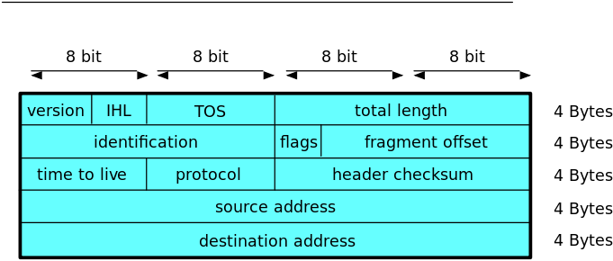

## CSET 2200 - Lecture 6

### Layer 3 - IPv4

---

## Review/Questions

---

## Moving up the stack

---

## Moving up the stack

---

## Why do we need Layer 3

- Aggregation
- Decouple hardware from address

---

## IPv4

- One of many Layer 3 protocols
- Main focus of this class
- Base layer of TCP/IP
- PDU called Packet

---

## IPv4 (contd)

- Connectionless
- Best effort delivery
- Unreliable
- Layer 4 deals wth some of this

---

## Packet consists of Header and Data

- Headers get much more complicated
- Contain address and other data

---

## IPv4 Addresses

- 32 bit
- Normally written as "dotted quad" - a.b.c.d
- Allocated by IANA (Internet Assigned Numbers Authority)

---

## IPv4 Addresses (contd)

- Address divided into hosts and network
- Multiple "networks" each containing given "hosts"
- Each network present on a logical layer 2 network

---

## IPv4 Addresses (contd)

- Network size varies
- Originally varied based on multiple classes

---

## Network Classes

- Originally 5 classses
- labelled A-E
- Only A-C used in practice, with D being Multicast

---

## Quick binary refresher

- Binary 0 and 1
- Multiple bits into bytes
- We'll write least significant on right

---

## Binary bits

> - 128  64  32  16  8  4  2  1
> -   1   1   0   0  0  0  0  1
> - 128 + 64 + 1
> - 193

---

## Class A Network

- Addresses start with 0xxxxxxx
- 0.0.0.0 - 127.255.255.255
- 128 networks
- 2^24 hosts (16777216) per network

---

## Class B Network

- Addresses start with 10xxxxxx
- 128.0.0.0 - 191.255.255.255
- 16384 networks
- 2^16 hosts (65536) per network

---

## Class C Network

- Addresses start with 110xxxxx
- 192.0.0.0 - 223.255.255.255
- 2^21 networks (2097152)
- 256 hosts per network

---

## Class D Network

- Addresses start with 1110xxxx
- 224.0.0.0 - 239.255.255.255
- Multicast

---

## Class E Network

- Addresses start with 1111xxx
- 240.0.0.0 - 255.255.255.255
- Experimental

---

## Reserved Addresses

- 0.0.0.0/8 - Current Network
- 10.0.0.0/8 - Private Network (RFC1918)
- 127.0.0.0/8 - Loopback
- 169.254.0.0/16 - Link-Local
- 172.16.0.0/12 - Private Network (RFC1918)
- 192.168.0.0/16 - Private Network (RFC1918)

---

## Other address info

- First usable typically network
- Last is broadcast
- We'll get to the current way addresses assigned soon

---

## Questions

---

## IPv4 Packet Format

- Header
    - Length Variable
    - Minimum length 5 32 bit words (20 bytes)
    - Max length 15 words (60 bytes)
- Followed by data (Not included in checksum)

---

## IPv4 Packet Header

---

## IPv4 Packet Header

- 4 bit field - always 4 for IPv4

---

## IPv4 Packet Header

- Internet Header Length - length of header in words
- 4 bits
- Min 5, max 15

---

## IPv4 Packet Header

- 8 bit field - Type of Service
- Used by Quality of Service

---

## IPv4 Packet Header

- 16 bit field - Total packet length
- Min 20, Max 65535

---

## IPv4 Packet Header

- 16 bit field - Used for fragment identification

---

## IPv4 Packet Header

- 3 bits - bit 1 always 0
- bit 2 Do Not Fragment
- bit 3 More Fragments

---

## IPv4 Packet Header

- 13 bits
- Measures fragment offset in 8 byte increments

---

## IPv4 Packet Header

- 8 bits - Time to Live
- Decrements 1 with each hop
- Helps prevent loops

---

## IPv4 Packet Header

- 8 bits
- Represents protocol on top of IP
- List maintained by IANA

---

## IPv4 Packet Header

- 16 bits
- Only calculated on header
- Due to TTL, rewritten every hop

---

## IPv4 Packet Header

- 32 bit
- Source address

---

## IPv4 Packet Header

- 32 bit
- Destination address

---

## IPv4 Packet Header

- Varied length depending on IHL
- Rarely used
- Many Routers block

---

## Examples packets

---

## Questions

---

## Next class

- More IP subnetting
- Basic Routing
- https://en.wikipedia.org/wiki/Classless_Inter-Domain_Routing
- Book chapter 21
