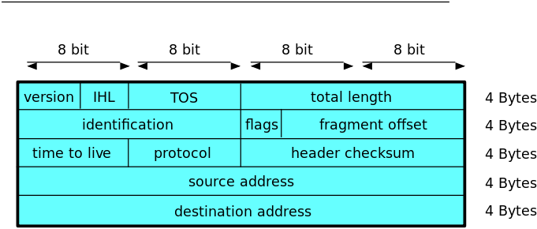

## CSET2200 - Lecture 7

---

## Review/Questions

---

## IPv4 Packet Format

- Header
    - Length Variable
    - Minimum length 5 32 bit words (20 bytes)
    - Max length 15 words (60 bytes)
- Followed by data (Not included in checksum)

---

## IPv4 Packet Header

---

## IPv4 Packet Header

- 4 bit field - always 4 for IPv4

---

## IPv4 Packet Header

- Internet Header Length - length of header in words
- 4 bits
- Min 5, max 15

---

## IPv4 Packet Header

- 8 bit field - Type of Service
- Used by Quality of Service

---

## IPv4 Packet Header

- 16 bit field - Total packet length
- Min 20, Max 65535

---

## IPv4 Packet Header

- 16 bit field - Used for fragment identification

---

## IPv4 Packet Header

- 3 bits - bit 1 always 0
- bit 2 Do Not Fragment
- bit 3 More Fragments

---

## IPv4 Packet Header

- 13 bits
- Measures fragment offset in 8 byte increments

---

## IPv4 Packet Header

- 8 bits - Time to Live
- Decrements 1 with each hop
- Helps prevent loops

---

## IPv4 Packet Header

- 8 bits
- Represents protocol on top of IP
- List maintained by IANA

---

## IPv4 Packet Header

- 16 bits
- Only calculated on header
- Due to TTL, rewritten every hop

---

## IPv4 Packet Header

- 32 bit
- Source address

---

## IPv4 Packet Header

- 32 bit
- Destination address

---

## IPv4 Packet Header

- Varied length depending on IHL
- Rarely used
- Many Routers block

---

## Examples packets

---

## Subnets

- "Host" section labels host
- "Network" section labels networks
- Use a subnet mask to seperate the two

---

## Subnet Masks

- Binary Mask shows network vs host
- 1 indicates network
- 0 host
- Also written as dotted quad

---

## Subnet Mask Examples

- 255.255.255.0 - Class C
- 11111111 11111111 11111111 00000000

- 255.255.0.0 - Class B
- 11111111 11111111 00000000 00000000

- 255.0.0.0 - Class A
- 11111111 00000000 00000000 00000000

---

## Written Examples - Questions

---

## Networks and Hosts

- Hosts all on the same local logical layer 2
- Networks are collections of hosts
- How do we connect them

---

## Routing

- Process of getting packets between networks
- Performed by routers
- L3 Switches are a type of router

---

## Example

- DIAGRAM HERE

---

## Route Tables

- Contain networks and destinations
- ex: 192.168.50.0 255.255.255.0 -> 192.168.49.1
- Default written as 0.0.0.0 with a mask of 0.0.0.0

---

## Route tables (contd)

- Built manually (called static)
- May also be built by a routing protocol
- We won't focus on routing protocols but may touch

---

## Examples

---

## Questions

---

## Next - VLSM Part 1 - Chapter 21
