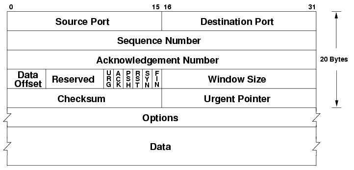
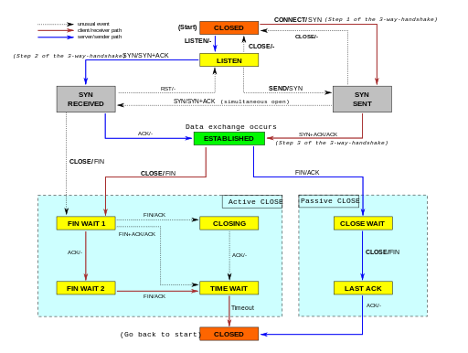

## CSET 2200 Lecture 10

---

## Review/Questions

---

## Layer 4

- Next Layer above Layer 3
- For our purpose Layer 4 means TCP/UDP and ICMP
- Adds services on top of layer 3

---

## TCP

- Transmission Control Protocol
- Connection Oriented
- One of the main protocols used on internet

---

## TCP (contd)

- Reliable Delivery
    - Error corrected
    - Packets in order
    - Lost packets retransmitted

---

## TCP (contd)

- Virtual connection
    - Acts as if a independent connection

---

## TCP (contd)

- PDU is Segments
- Segments contain user data
- TCP ensures bytes out match bytes in

---

## TCP (contd)

- TCP also provides multiplexing
- Does so by using ports
- 65535 possible ports

---

## TCP Header

---

## TCP Connections

- Relies on 3 way handshake
- Receiving end opens port
- Sender sends SYN
- SYN + ACK
- ACK

---

## TCP Transfers

- Each packet gets an ACK
- Timer for each packet - retransmit if no ack
- Waits for ack before next packet
- Windowing changes above

---

## Connection Termination

- Person disconnecting sends FIN
- Other end ACK
- Same ends sends FIN
- Final ACK

---

## TCP State Machine

---

## TCP Window

- Allows multiple packets without ACK
- Up to amount specified in window size header
- Window "slides" past all ACK'd packets
- Newer TCP uses a multiplier on window size

---

## Options

- Unlike IP, lots of options used
    - NOP for padding
    - Maximum Segment Size
    - Window Scale
    - Timestamp and previous timestamp

---

## Security issues with TCP

  - Spoofing
  - Connection Teardown
  - RST

---

## TCPDump Examples

---

## Questions

---

## Next Session - UDP/ICMP

- Chapter 23, 25
